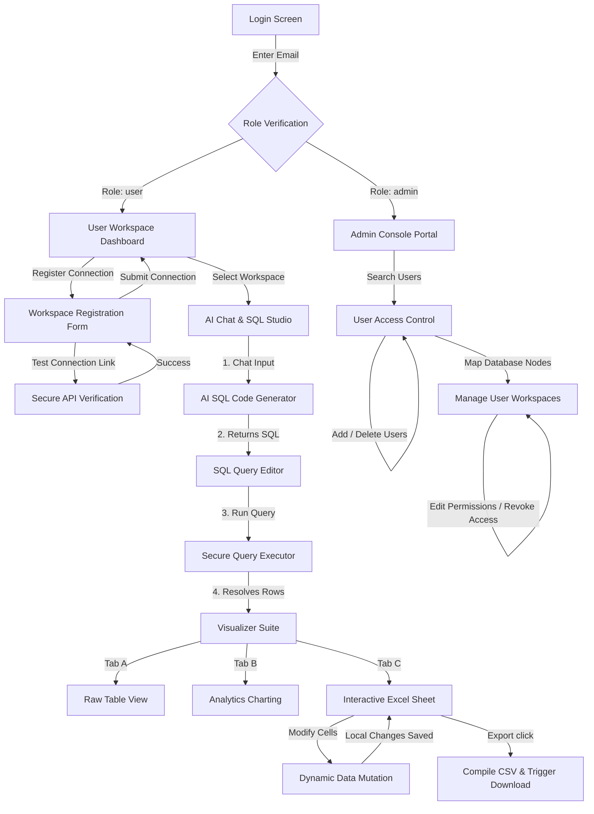

# AskDb - Mock User Details, Application Flow & Functionality Guide

Welcome to the comprehensive guide for **AskDb**, an enterprise-grade AI-powered database assistant. This document provides a complete lookup of mock credentials, details the application flow, and guides you through every feature—from connection testing to exporting custom Excel sheets.

---

## 1. Mock User Credentials & Workspace Scopes

AskDb runs in a simulated secure corporate environment where authorization scopes determine what database connections are accessible. 

Below is the authorization table compiled from [mock-details.json](file:///d:/ASK/AskDb/src/app/mock-details.json) and [workspace.service.ts](file:///d:/ASK/AskDb/src/app/services/workspace.service.ts):

| Name | Role | Email Address | Password | Associated Workspaces & Access Levels |
| :--- | :--- | :--- | :--- | :--- |
| **System Administrator** | `admin` | `admin@cgi.com` | `admin` *(or any)* | **All Workspaces / Admin Portal Console** |
| **John Doe** | `user` | `john.doe@cgi.com` | *(any)* | <ul><li>`Sales Analytics` (SQL Server, Prod, **Read Only**, 183 Tables)</li><li>`Customer Feedback` (PostgreSQL, UAT, **Read Only**, 48 Tables)</li></ul> |
| **Jane Smith** | `user` | `jane.smith@cgi.com` | *(any)* | <ul><li>`Marketing Campaign` (MySQL, Dev, **Owner**, 35 Tables)</li></ul> |
| **Alex Johnson** | `user` | `alex.johnson@cgi.com` | *(any)* | <ul><li>`Billing Sandbox` (PostgreSQL, Dev, **Owner**, 43 Tables)</li><li>`Customer Feedback` (PostgreSQL, UAT, **Read Only**, 48 Tables)</li></ul> |

> [!NOTE]
> * When logging in, you can input the mock user's **Email Address**.
> * Since mock mode is active by default (configured in [api.config.ts](file:///d:/ASK/AskDb/src/app/config/api.config.ts)), passwords are automatically accepted during validation.

---

## 2. End-to-End Application Flow

The diagram below outlines the core runtime architecture and state-flow logic of the application:



---

## 3. Walkthrough of Application Functionalities

### 3.1 Corporate Login System
* **File Location**: [login.ts](file:///d:/ASK/AskDb/src/app/login/login.ts) | [auth.service.ts](file:///d:/ASK/AskDb/src/app/services/auth.service.ts)
* **How it works**: The login form accepts a corporate email ending with `@cgi.com`.
* **Validation Logic**:
  * An input matching `admin@cgi.com` resolves the System Administrator role and routes the user directly to the **Admin Workspace Portal**.
  * Valid user emails load the matching workspaces and route to the **User Workspace Dashboard**.

---

### 3.2 Workspace Landing Dashboard
* **File Location**: [work-space.ts](file:///d:/ASK/AskDb/src/app/work-space/work-space.ts)
* **How it works**: Displays summary cards indicating the count of Production, UAT, and Development database nodes.
* **Search & Filter**: Users can filter database workspaces by text queries or click target tabs (e.g. *Production*, *UAT*, *Development*) to filter by environment.
* **Secure Handshake**: Clicking on a workspace card triggers a simulated API connection handshake (1.5-second latency), alerts the user with a loading toast, and opens the chat interface for that workspace context.

---

### 3.3 Workspace Registration (New Database Connections)
* **File Location**: [workspace-registration.ts](file:///d:/ASK/AskDb/src/app/ai-chat/workspace-registration/workspace-registration.ts)
* **How it works**: Users can register new workspaces directly by inputting target parameters:
  * Workspace Name
  * Database Provider Type (`SQL Server`, `PostgreSQL`, `MySQL`, `MongoDB`, `Oracle`, `SQLite`)
  * Environment Type (`Production`, `UAT`, `Development`)
  * Host, Port, Username, Password, Database Name, Mongo URI, etc.
* **Testing Connections**: Clicking **Test Connection** communicates connection details to the backend API via [WorkspaceService](file:///d:/ASK/AskDb/src/app/services/workspace.service.ts) (which simulates a 1.5-second latency before resolving success or throwing a network error if credentials are empty).
* **Registration**: Upon successful registration, a workspace is automatically prepended to the user's dashboard and state-cached.

---

### 3.4 AI-Powered Chat & SQL Generation
* **File Location**: [ai-chat.ts](file:///d:/ASK/AskDb/src/app/ai-chat/ai-chat.ts) | [chat-query.service.ts](file:///d:/ASK/AskDb/src/app/services/chat-query.service.ts)
* **How it works**: Once a workspace is active, the AI Chat assistant synchronizes with the database schema model. The user can type questions in natural language.
* **Intelligent LLM Parsing**:
  * If the user mentions **"revenue"**, **"customer"**, or **"top sales"**, the service constructs a `SELECT TOP 10` query matching revenue aggregations over invoices.
  * Mentioning **"stock"**, **"product"**, or **"inventory"** compiles a scan on units in stock with minimum reorder thresholds.
  * Mentioning **"performance"**, **"monthly"**, or **"summarize"** aggregates total sales by month.
  * General questions fall back to scanning metadata records.
* The query is placed directly inside the **Query Editor** tab for live edits.

---

### 3.5 SQL Query Editor & Secure Execution
* **File Location**: [ai-chat.ts](file:///d:/ASK/AskDb/src/app/ai-chat/ai-chat.ts) (using `runQuery()`)
* **How it works**: In the Query Editor tab, the user can review, modify, and type any raw SQL statement.
* **Execution**: Clicking **Run Query** sends the script to the database execution engine. The UI displays an executing progress indicator and updates the visualization cards upon receiving response datasets.

---

### 3.6 Tri-Mode Result Visualizations
* **File Location**: [ai-chat.html](file:///d:/ASK/AskDb/src/app/ai-chat/ai-chat.html)
* Once queries execute, data results are displayed in three toggleable tabs:
  1. **Table View**: A high-performance tabular list detailing column keys and row records.
  2. **Charts View**: Visual representations of the data (such as vertical bars, line graphs, and markers).
  3. **Excel Sheets**: A fully interactive spreadsheet.

---

### 3.7 Interactive Excel Spreadsheet & Cell Editing
* **File Location**: [query-excel.ts](file:///d:/ASK/AskDb/src/app/ai-chat/query-visualizer/query-excel/query-excel.ts)
* **Interactive Grid**: Renders the dataset in an Excel-like grid layout with column header labels (`A`, `B`, `C`, etc.) and indexed row headers (`1`, `2`, `3`, etc.).
* **Live Updates**: Clicking on any cell transforms it into a text input. Modifying the cell immediately mutates the dataset in the application state and fires a `DataChanged` event. This lets users adjust values on-the-fly before generating report assets.

---

### 3.8 Exporting & Downloading Excel reports
* **File Location**: [query-excel.ts](file:///d:/ASK/AskDb/src/app/ai-chat/query-visualizer/query-excel/query-excel.ts) (using `exportToExcel()`)
* **How it works**: When the **Export to Excel** button is clicked:
  1. The system reads the active state of `editableResults` (which includes any cell edits made by the user).
  2. It formats the table columns as CSV headers.
  3. It maps and formats the rows, escaping double quotes (`""`) to prevent CSV injection or breaking parsing frameworks.
  4. It builds a text/csv character blob.
  5. It triggers a client-side download of a file named `AskDB_Report.csv`.
  6. A success message toast is displayed: *"Spreadsheet compiled! Downloading AskDB_Report.csv..."*.

---

### 3.9 Enterprise Administration Console
* **File Location**: [admin-workspace.ts](file:///d:/ASK/AskDb/src/app/admin-workspace/admin-workspace.ts)
* Available only to users with the `admin` role (e.g. `admin@cgi.com`):
  * **User Directory**: Search through enterprise users by Name or Email.
  * **Add Users**: Instantiate new corporate user profiles. Validates email formats (`@cgi.com`).
  * **Delete Users**: Remove a user profile along with all assigned database workspace scopes.
  * **Workspace Management**:
    * Assign database nodes to users (specifying provider, environment, access levels like `Owner`/`Read Only`, and counts for tables and schemas).
    * Edit existing assignments.
    * Revoke access to database nodes.

---

## 4. Practical Role-Based Workflows

### 4.1 Admin Role: User & Database Access Provisioning Workflow
This workflow utilizes the exact mock admin credentials and workspace details to manage user authorizations.

 1. **Log in as Admin**:
   * Navigate to the Login Screen.
   * Input the mock admin credentials: **Email**: `admin@cgi.com` and **Password**: `admin`.
   * Click **Sign In**. Observe redirection to the [Admin Console Portal](file:///d:/ASK/AskDb/src/app/admin-workspace/admin-workspace.html).
 2. **Select an Existing Mock User**:
   * From the sidebar list of corporate users, select **Alex Johnson** (`alex.johnson@cgi.com`).
   * Observe his two currently assigned database workspaces on the dashboard:
     * `Billing Sandbox` (PostgreSQL, Development, Access: Owner, 43 tables)
     * `Customer Feedback` (PostgreSQL, UAT, Access: Read Only, 48 tables)
3. **Provision a New Workspace Connection to Alex Johnson**:
   * Click **+ Add Workspace Access** (triggers `showAddWsModal = true`).
   * Add the mock **Marketing Campaign** workspace settings:
     * **Database Name**: `Marketing Campaign`
     * **Provider**: `MySQL`
     * **Environment**: `Development`
     * **Access Level**: `Owner`
     * **Table Count**: `35`
     * **Schema Count**: `6`
   * Click **Assign Database**. The new MySQL workspace is immediately bound to Alex Johnson and cached in local storage.
4. **Edit Existing Access Level Permissions**:
   * Locate the `Customer Feedback` database card in Alex's list.
   * Click the **Edit (Pencil Icon)** button.
   * Change his **Access Level** from `Read Only` to `Owner`.
   * Click **Save Changes** (executes `editWorkspaceForUser()`).
5. **Log Out**:
   * Click the **Sign Out** button in the top navigation header to return to the landing portal.

---

### 4.2 User Role: Natural Language Querying, Excel Mutation & Reporting Workflow
This workflow uses the exact mock user **John Doe**, his **Sales Analytics** workspace, and the simulated database revenue query.

1. **Log in as Mock User**:
   * Input John Doe's email: `john.doe@cgi.com` at the login screen.
   * Click **Sign In** to access the [User Dashboard](file:///d:/ASK/AskDb/src/app/work-space/work-space.html).
2. **Launch Database Workspace Connection**:
   * View John's preloaded workspaces: `Sales Analytics` (Prod, SQL Server) and `Customer Feedback` (UAT, PostgreSQL).
   * Click on the **Sales Analytics** card.
   * Watch the connection handshake load for 1.5 seconds, then transition to the [AI Chat Interface](file:///d:/ASK/AskDb/src/app/ai-chat/ai-chat.html).
3. **AI Chat Negotiation (Plain-English to SQL)**:
   * In the message input, type: `"Show me top sales customers by revenue"` and click **Send**.
   * Observe the AI Chat response:
     * The chatbot processes the word **"revenue"** and returns a precompiled response containing aggregate customer SQL:
       ```sql
       SELECT TOP 10 
         c.CustomerName,
         c.Country,
         SUM(o.TotalAmount) AS Revenue
       FROM Customers c
       JOIN Orders o ON c.CustomerID = o.CustomerID
       WHERE o.OrderDate >= '2026-01-01'
       GROUP BY c.CustomerName, c.Country
       ORDER BY Revenue DESC;
       ```
     * In the background, this generated SQL statement is loaded into the **Query Editor** tab.
4. **Review & Execute SQL Code**:
   * Switch from the **Assistant** tab to the **Query Editor** tab.
   * Review the loaded query and click the blue **Run Query** button.
   * A simulated API handshake occurs, followed by the success notification: *“SQL query executed successfully!”*.
5. **Multi-Mode Analytics & Excel Sheets**:
   * Expand the Results Panel below the editor and switch to the **Excel Sheets** tab.
   * Verify the preloaded mock dataset loads into the editable grid:
     * **Row 1**: Customer: `Acme Corp` \| Country: `United States` \| Revenue: `$245,000`
     * **Row 2**: Customer: `TechNova Solutions` \| Country: `Canada` \| Revenue: `$190,000`
     * **Row 3**: Customer: `FutureSoft Group` \| Country: `United Kingdom` \| Revenue: `$175,000`
     * **Row 4**: Customer: `GlobalTrade Inc` \| Country: `Germany` \| Revenue: `$162,300`
     * **Row 5**: Customer: `Apex Industries` \| Country: `Australia` \| Revenue: `$148,900`
6. **Mutate Cell Records in Live Grid**:
   * Locate the `Revenue` cell for `Acme Corp` (showing `"$245,000"`).
   * Click inside the cell and overwrite it with `"$300,000"`.
   * Click out of the cell. The application triggers `handleDataChanged()` and updates the dataset in memory.
7. **Export the Spreadsheet**:
   * Click the green **Export to Excel** button.
   * Read the toast: *“Generating spreadsheet sheets... Compiled!”*
   * Check your local browser downloads folder for `AskDB_Report.csv`.
   * Open the file and verify that the row for `Acme Corp` has the mutated value of `"$300,000"`.


